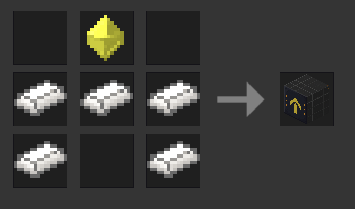
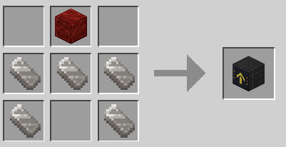

# escalator — Luanti (Minetest) Mod

A fully functional escalator system that transports **players, NPCs, and mobs**
smoothly along a diagonal stair incline built from any stair node (`group:stair`).

---

## Features

| Feature | Detail |
|---|---|
| **Controller block** | `escalator:controller` – place at the base of a staircase |
| **Universal Stair Support** | Works automatically with any stair node in MTG, VoxeLibre, and custom mods |
| **Direction** | Configurable **Up** or **Down** per controller |
| **Orientation** | North / South / East / West cardinal facing |
| **Transport** | Moves players, NPCs, and mobs via velocity override |
| **Legacy mob support** | Positional nudge via ABM for mobs without `set_velocity` |
| **Stack rule** | Controllers stack up to **10 high**, enforced on placement |
| **Performance** | Scans only the active stair-path; no global entity sweeps |
| **Tunable** | All speeds and lengths configurable via `settingtypes.txt` |

---

## Quick-start

1. **Copy** the `escalator/` folder into your game's `mods/` directory.
2. **Enable** the mod in the Content / Mods menu or `minetest.conf`.
3. **Craft** the controller:

   **Minetest Game (MTG) Recipe:**
   * Place a Mese Crystal at the top-center, and Steel Ingots in a U-shape:
   ```text
     [              ]  [ Mese Crystal ]  [              ]
     [ Steel Ingot  ]  [ Steel Ingot  ]  [ Steel Ingot  ]
     [ Steel Ingot  ]  [              ]  [ Steel Ingot  ]
   ```
     *(Uses `default:steel_ingot` and `default:mese_crystal`)*

   

   **MineClone2 / VoxeLibre Recipe:**
   * Place a Redstone Block at the top-center, and Iron Ingots in a U-shape:
   ```text
     [              ]  [Redstone Block]  [              ]
     [  Iron Ingot  ]  [  Iron Ingot  ]  [  Iron Ingot  ]
     [  Iron Ingot  ]  [              ]  [  Iron Ingot  ]
   ```
     *(Uses `mcl_core:iron_ingot` and `mesecons_torch:redstoneblock` / `mcl_redstone:redstone_block`)*

   

4. **Place the controller block**:
   - **Upward Escalator**: Place the controller block at the bottom of the staircase.
   - **Downward Escalator**: Place the controller block at the top platform behind the stairs.
5. Step onto any stair — you'll be smoothly carried along!

---

## 📐 How to Place the Controller

### ↗️ Upward Escalator
Place the controller block at the bottom base of the stairs:

```text
       ↗️ Stair
     ↗️ Stair
   ↗️ Stair
⬛ Controller
```

### ↘️ Downward Escalator
Place the controller block on the top platform directly behind the first descending stair step:

```text
⬛ Controller ↘️ Stair
               ↘️ Stair
                 ↘️ Stair
```

The controller automatically scans up to 32 stairs along the diagonal.

---

## Configuration (`settingtypes.txt`)

| Setting | Default | Description |
|---|---|---|
| `escalator_h_speed` | `1.5` | Horizontal speed (nodes/s) |
| `escalator_v_speed` | `1.5` | Vertical speed (nodes/s) |
| `escalator_max_stair_length` | `32` | Max stair nodes scanned |
| `escalator_timer_interval` | `0.15` | Controller timer interval (s) |
| `escalator_max_stack` | `10` | Max controller stack height |

---

## Debug command

```
/escalator_info
```
Look at a controller (within 8 nodes) and run this command to see its current
configuration and how many stair steps were detected.

---

## Compatibility

- **Luanti** (formerly Minetest) ≥ 5.6
- **stairs** / **mcl_stairs** mod (standard in almost all games)
- **MTG (Minetest Game)** – full compatibility (using any `stairs:stair_*` block and standard steel/mese recipe)
- **VoxeLibre / MineClone2 / Mineclonia** – full compatibility (using any `mcl_stairs:stair_*` block and iron/redstone block recipe)

---

## License

MIT – do whatever you want, attribution appreciated.
